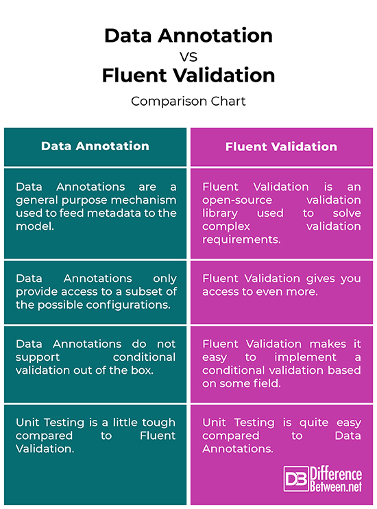

# EF Core – Requirements and Setup

## 1. Prerequisites

Before using Entity Framework Core, you should have:

* Basic knowledge of **C#**
* Basic knowledge of **.NET**
* Understanding of **Object-Oriented Programming (OOP)**
* Basic knowledge of **SQL**
* Basic understanding of **Databases**
* **Visual Studio** or another .NET-compatible IDE
* A **.NET project** such as Console Application or ASP.NET Core Web API

---

## 2. Required NuGet Packages

To use EF Core with SQL Server, install the following packages:

```bash
Microsoft.EntityFrameworkCore
Microsoft.EntityFrameworkCore.SqlServer
Microsoft.EntityFrameworkCore.Tools
```

### Package Responsibilities

| Package                                   | Purpose                      |
| ----------------------------------------- | ---------------------------- |
| `Microsoft.EntityFrameworkCore`           | Core EF Core functionality   |
| `Microsoft.EntityFrameworkCore.SqlServer` | SQL Server database provider |
| `Microsoft.EntityFrameworkCore.Tools`     | EF Core tools and migrations |

> **Note:** Make sure the EF Core package versions are compatible with your project's .NET version.

---

## 3. DbContext

Create a class that inherits from `DbContext`.

```csharp
public class ApplicationDbContext : DbContext
{
}
```

### What is DbContext?

`DbContext` is the main class used by EF Core to communicate with the database.

It is responsible for:

* Managing database connections
* Querying data
* Saving changes
* Tracking entities
* Managing database operations

---

## 4. Entities

An Entity is a C# class that represents data in the database.

Example:

```csharp
public class Product
{
    public int Id { get; set; }
    public string Name { get; set; }
    public decimal Price { get; set; }
}
```

The `Product` class can be mapped to a `Products` table in the database.

---

## 5. DbSet

Add a `DbSet` to the `DbContext`:

```csharp
public class ApplicationDbContext : DbContext
{
    public DbSet<Product> Products { get; set; }
}
```

`DbSet<Product>` represents the collection of `Product` entities in the database.

You can use it to perform operations such as:

```csharp
context.Products.ToList();
```

---

## 6. Database Provider

EF Core needs a database provider to communicate with a specific database system.

For SQL Server:

```csharp
options.UseSqlServer(connectionString);
```

Other providers include:

* SQL Server
* PostgreSQL
* SQLite
* MySQL

---

## 7. Connection String

A connection string contains the information required to connect to the database.

Example:

```json
{
  "ConnectionStrings": {
    "DefaultConnection": "Server=.;Database=MyDb;Trusted_Connection=True;TrustServerCertificate=True"
  }
}
```

For ASP.NET Core applications, the connection string is commonly stored in:

```text
appsettings.json
```

---

## 8. Register DbContext

In an ASP.NET Core application, register the `DbContext` in `Program.cs`:

```csharp
builder.Services.AddDbContext<ApplicationDbContext>(options =>
    options.UseSqlServer(
        builder.Configuration.GetConnectionString("DefaultConnection")));
```

This allows ASP.NET Core's Dependency Injection system to create and provide the `ApplicationDbContext`.

---

## 9. Migrations

EF Core Migrations are used to keep the database schema synchronized with the application's entity classes.

Example:

```powershell
Add-Migration InitialCreate
```

Then apply the migration:

```powershell
Update-Database
```

Or using the .NET CLI:

```bash
dotnet ef migrations add InitialCreate
dotnet ef database update
```

---

## 10. LINQ

EF Core works heavily with LINQ.

Example:

```csharp
var products = await context.Products
    .Where(p => p.Price > 100)
    .ToListAsync();
```

EF Core translates the LINQ query into SQL and executes it against the database.

---

# Basic EF Core Architecture

```text
Application
     ↓
DbContext
     ↓
Entity / DbSet
     ↓
EF Core
     ↓
Database Provider
     ↓
Database
```

---

# What You Should Learn After Setup

After understanding the basic setup, learn these topics in order:

1. `DbContext`
2. `DbSet`
3. Entities
4. CRUD Operations
5. LINQ with EF Core
6. Relationships

   * One-to-One
   * One-to-Many
   * Many-to-Many
7. Data Annotations
8. Fluent API
9. Migrations
10. Dependency Injection
11. Eager Loading (`Include`)
12. Explicit Loading
13. Lazy Loading
14. Tracking vs `AsNoTracking()`
15. Transactions
16. Concurrency
17. Query Optimization
18. EF Core Performance

---

# Minimum Requirements

In short, to start using EF Core with SQL Server, you need:

```text
C#
.NET
SQL / Database Basics
EF Core
SQL Server Provider
DbContext
Entities
DbSet
Connection String
Migrations
```

> **Important:** EF Core does not replace SQL knowledge. You should still understand SQL, relationships, indexes, constraints, and database fundamentals.
------
# DbSet in EF Core

```csharp
public DbSet<Employee> Employees { get; set; }
```

### What is DbSet?

`DbSet<Employee>` represents the **Employee table** in the database.

It allows us to work with `Employee` objects and perform database operations such as:

* Add employees
* Get employees
* Update employees
* Delete employees

### Breaking it down

```csharp
public DbSet<Employee> Employees { get; set; }
```

* `public` → The property can be accessed from outside the class.
* `DbSet<Employee>` → Represents a collection of `Employee` entities.
* `Employees` → The name of the property and usually the database table name.
* `get; set;` → Allows reading and assigning the property.

### Example

```csharp
var employees = context.Employees.ToList();
```

This retrieves employees from the `Employees` table.

### In Simple Words

> **DbSet = A way to access a database table through EF Core.**
------
# EF Core Migrations: History vs Snapshot

## 1. `__EFMigrationsHistory`

`__EFMigrationsHistory` is a **table inside the database**.

It stores the migrations that have already been applied to the database.

Example:

```text
MigrationId
-----------------------------
20260828001_InitialCreate
20260828002_AddEmployee
20260828003_AddDepartment
```

EF Core uses this table when running:

```powershell
Update-Database
```

### Main Question

> **Which migrations have already been applied?**

---

## 2. `ApplicationDbContextModelSnapshot`

`ApplicationDbContextModelSnapshot` is a **C# file inside your project**.

It stores the **latest state of your EF Core model** after the last migration.

When you run:

```powershell
Add-Migration AddSalary
```

EF Core compares:

```text
Current Model
      ↓
ModelSnapshot
      ↓
Detect Changes
      ↓
Generate New Migration
```

### Main Question

> **What did my model look like after the last migration?**

---

## Quick Difference

|                | `__EFMigrationsHistory`   | `ModelSnapshot`               |
| -------------- | ------------------------- | ----------------------------- |
| Location       | Database                  | Project                       |
| Type           | Table                     | C# File                       |
| Purpose        | Tracks applied migrations | Tracks the latest model state |
| Mainly used by | `Update-Database`         | `Add-Migration`               |

## Easy Way to Remember

```text
__EFMigrationsHistory
        ↓
"What migrations were applied?"

ModelSnapshot
        ↓
"What does my model look like now?"
```

**Migration** = Contains the changes needed to update the database from the old state to the new state.
-----
# Remove-Migration Error

This error means the migration has **already been applied to the database**.

For example:

```powershell
Add-Migration InitialCreate
Update-Database
```

Now:

```powershell
Remove-Migration
```

will fail because the migration exists in the database history.

## Solution

If you want to remove it:

```powershell
Update-Database 0
Remove-Migration
```

### Remember

```text
Remove-Migration
→ Removes the migration from the project.

Update-Database 0
→ Rolls the database back to the initial state.
```

⚠️ Be careful with `Update-Database 0` because it can remove database changes and data.
----
## Data Seeding in EF Core

**Custom SQL in Migration** is used to insert or modify data directly during a migration.

- `Up()` → Executes the changes.
- `Down()` → Reverts the changes.
- `migrationBuilder.Sql()` → Executes raw SQL.

Example:


migrationBuilder.Sql("INSERT INTO Employees VALUES ('John')");

-------------------------------

## Rollback to a Specific Migration

```powershell
Update-Database 20260828162058_initMigration
````

This **rolls the database back to the specified migration**.

* Migrations after `initMigration` → **rolled back**
* `initMigration` itself → **remains applied**

```
```
--------------------
## Data Annotations vs Fluent API — Interview Answer

**Data Annotations** use attributes on entity classes to configure the EF Core model, while **Fluent API** configures the model using code, usually inside `OnModelCreating()`.

### Key Differences

- **Data Annotations:** Simple and easy to use.
- **Fluent API:** More powerful and flexible.
- **Data Annotations:** Configuration is placed inside the entity.
- **Fluent API:** Keeps configuration separate from the entity.
- **Fluent API has higher precedence** than Data Annotations.

### Interview Answer

> "Data Annotations are attributes used directly on entities to configure the EF Core model. Fluent API uses code in `OnModelCreating()` to configure the model. Fluent API is more flexible and has higher precedence, so I prefer it for complex configurations."



------
## Entity Type Configuration

`IEntityTypeConfiguration<T>` is used to configure an entity separately from the entity class using the **Fluent API**.

```csharp
public class BlogEntityTypeConfiguration : IEntityTypeConfiguration<Blog>
{
    public void Configure(EntityTypeBuilder<Blog> builder)
    {
        builder.Property(b => b.Url)
               .IsRequired()
               .HasMaxLength(200);
    }
}
```

Apply the configuration in `DbContext`:

```csharp
protected override void OnModelCreating(ModelBuilder modelBuilder)
{
    modelBuilder.ApplyConfiguration(
        new BlogEntityTypeConfiguration()
    );
}
```

### Benefits

* Keeps configuration separate from the Entity.
* Uses Fluent API.
* Better organization for large projects.
* Makes entity configuration reusable and easier to maintain.
----------------

# Entity Configuration in EF Core

Entity Configuration is the process of defining how an **Entity** maps to a **Database Table** using **Fluent API**.

## Step 1: Create the Entity

```csharp
public class Blog
{
    public int Id { get; set; }
    public string Url { get; set; }
}
````

This represents a `Blog` table in the database.

---

## Step 2: Create a Configuration Class

Implement `IEntityTypeConfiguration<T>`:

```csharp
public class BlogEntityTypeConfiguration
    : IEntityTypeConfiguration<Blog>
{
    public void Configure(EntityTypeBuilder<Blog> builder)
    {
        builder.Property(b => b.Url)
               .IsRequired()
               .HasMaxLength(200);
    }
}
```

### What does this mean?

* `IEntityTypeConfiguration<Blog>` → This configuration belongs to the `Blog` entity.
* `Configure()` → Contains the entity configuration.
* `EntityTypeBuilder<Blog>` → Provides Fluent API methods to configure `Blog`.

---

## Step 3: Configure the Properties

```csharp
builder.Property(b => b.Url)
```

Selects the `Url` property.

```csharp
.IsRequired()
```

Makes the column **NOT NULL**.

```csharp
.HasMaxLength(200)
```

Sets the maximum length to **200 characters**.

---

## Step 4: Apply the Configuration

Inside your `DbContext`:

```csharp
protected override void OnModelCreating(ModelBuilder modelBuilder)
{
    modelBuilder.ApplyConfiguration(
        new BlogEntityTypeConfiguration()
    );
}
```

`ApplyConfiguration()` tells EF Core to use the configuration we created.

---

## Step 5: Result

EF Core will use this configuration when creating the database schema.

Conceptually:

```text
Blog Entity
    ↓
BlogEntityTypeConfiguration
    ↓
Fluent API
    ↓
Database Table
```

The `Url` column will be configured as:

```text
Url
├── Required
└── Max Length: 200
```

## Interview Answer

> "Entity configuration in EF Core allows us to configure an entity using Fluent API separately from the entity class. We implement `IEntityTypeConfiguration<T>`, put the configuration inside the `Configure` method, and then apply it in `OnModelCreating` using `ApplyConfiguration`. This keeps our entities clean and makes the configuration easier to maintain."

```
```

----
## Blog and Post Relationship

This is a **One-to-Many Relationship**.

* One `Blog` can have many `Posts`.
* Each `Post` belongs to one `Blog`.

### Navigation Properties

```csharp
public List<Post> Posts { get; set; }
```

`Blog.Posts` → Collection Navigation

```csharp
public Blog Blog { get; set; }
```

`Post.Blog` → Reference Navigation

### Foreign Key

```csharp
public int BlogId { get; set; }
```

`Post.BlogId` → Foreign Key (FK)

### Fluent API

```csharp
modelBuilder.Entity<Blog>()
    .HasMany(b => b.Posts)
    .WithOne(p => p.Blog)
    .HasForeignKey(p => p.BlogId);
```

### Summary

```text
Blog (1) ────────< Post (Many)
```

**One Blog → Many Posts**
------------------

## Cascade vs Restrict in SQL and EF Core

Relationship:

`Department → Employee`

### Cascade

Deleting a `Department` automatically deletes its related `Employees`.

```csharp
OnDelete(DeleteBehavior.Cascade);
````

### Restrict

You cannot delete a `Department` if it has related `Employees`.

```csharp
OnDelete(DeleteBehavior.Restrict);
```

### In short

* `Cascade` → Delete the Department → Delete related Employees.
* `Restrict` → Prevent deleting the Department if Employees exist.

#SQL #EFCore #CSharp #DotNet #Database #Backend

```
```

-----------

## Ways to Register Domain Models in ApplicationDbContext

There are 3 common ways:

1. **DbSet**
```csharp
public DbSet<Employee> Employees { get; set; }
````

2. **Navigation Property**

```csharp
public Department Department { get; set; }
```

3. **ModelBuilder**

```csharp
modelBuilder.Entity<Employee>();
```

**Summary:**
`DbSet` and `Navigation Property` help EF Core discover entities automatically, while `ModelBuilder` gives you more control over configuration.

```
```

------

## Ignore vs NotMapped in EF Core

If you don't want EF Core to map a Model to the database:

### ModelBuilder


modelBuilder.Ignore<Post>();


### Data Annotation

```csharp
[NotMapped]
public class Post
{
}
```

### Summary

`Ignore()` → Tells EF Core to ignore the Model.

`[NotMapped]` → Tells EF Core not to map the Class or Property to the database.

```
```


-----

## ExcludeFromMigrations()

```csharp
modelBuilder.Entity<Blog>()
    .ToTable("Blogs", b => b.ExcludeFromMigrations());
````

It means:

> EF Core can use the `Blogs` table, but Migrations will not create or modify it.

### Benefit

Useful when the table already exists in the database and you don't want EF Core Migrations to manage it.

**In short:**

`ExcludeFromMigrations()` → Use the table normally, but ignore it in Migrations.


------------------------------
## `Ignore()` vs `[NotMapped]` in EF Core

### `builder.Ignore()`

```csharp
builder.Ignore(b => b.addedOn);
```

Means: **EF Core will completely ignore this property** and will not map it to a database column.

### `[NotMapped]`

```csharp
[NotMapped]
public DateTime addedOn { get; set; }
```

Means: **EF Core will not map this property** to the database.

### Main Difference

| `Ignore()`                           | `[NotMapped]`                              |
| ------------------------------------ | ------------------------------------------ |
| Fluent API                           | Data Annotation                            |
| Written in `OnModelCreating`         | Written above the property                 |
| Does not require changing the Entity | Requires adding an attribute to the Entity |

### Result

Both have the same effect:

```text
addedOn → Not mapped to a database column
```

### Which one should you use?

Use **Fluent API** when you want to keep your Entity classes clean and separate from EF Core configuration.

Use **`[NotMapped]`** when you prefer simple configuration directly on the property.
-------------
# Change Column Name

### Using Data Annotation

```csharp
[Column("PostTitle")]
public string Title { get; set; }
```

Maps the `Title` property to a database column named `PostTitle`.

### Using Fluent API

```csharp
modelBuilder.Entity<Post>()
    .Property(p => p.Title)
    .HasColumnName("PostTitle");
```

### Result

```text
C# Property    →    Database Column
-----------------------------------
Title          →    PostTitle
```

Both approaches have the **same purpose**.
------------------
# Column Data Types

You can specify the database column data type using **Data Annotations** or **Fluent API**.

### Using Data Annotation

```csharp
[Column(TypeName = "varchar(200)")]
public string Name { get; set; }
```

This maps the `Name` property to a `varchar(200)` column.

### Using Fluent API

```csharp
modelBuilder.Entity<User>()
    .Property(u => u.Name)
    .HasColumnType("varchar(200)");
```

### Common Examples

```csharp
.HasColumnType("varchar(100)")
.HasColumnType("decimal(18,2)")
.HasColumnType("datetime2")
```

### Result

```text
C# Property    →    Database Column Type
-----------------------------------------
Name           →    varchar(100)
Price          →    decimal(18,2)
CreatedAt      →    datetime2
```

**Note:** `HasColumnType()` specifies the **exact database data type**, while methods like `HasMaxLength()` configure the column's constraints without directly specifying the database type.
---
# Maximum Length

You can specify the maximum length of a string property using **Data Annotations** or **Fluent API**.

### Using Data Annotation

```csharp
[MaxLength(100)]
public string Name { get; set; }
```

This limits the `Name` property to a maximum of **100 characters**.

### Using Fluent API

```csharp
modelBuilder.Entity<User>()
    .Property(u => u.Name)
    .HasMaxLength(100);
```

### Result

```text
Name → Maximum 100 characters
```

### `MaxLength` vs `HasColumnType`

```csharp
[MaxLength(100)]
```

Defines the **maximum length** of the value.

```csharp
.HasColumnType("varchar(100)")
```

Defines the **exact database column type**.

**Note:** `HasMaxLength()` is generally preferred when you only need to specify the maximum length without forcing a specific database type.
---------------
# Column Comments

You can add a **comment/description** to a database column using Fluent API.

### Using Fluent API

```csharp
modelBuilder.Entity<User>()
    .Property(u => u.Name)
    .HasComment("The user's full name");
```

This adds a comment to the `Name` column in the database.

### Result

```text
Name → "The user's full name"
```

### Important

`HasComment()` is mainly used to **document the database schema**. It does **not** affect the application's logic or query performance.
